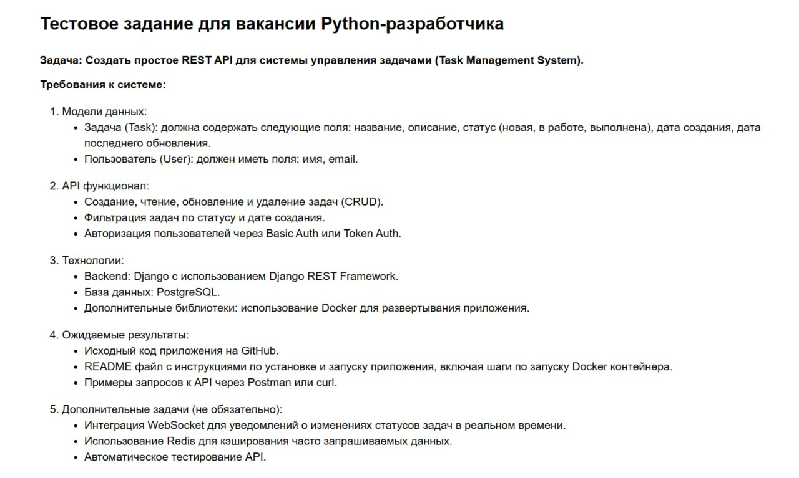
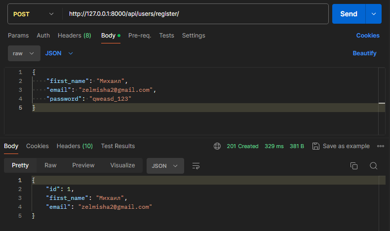
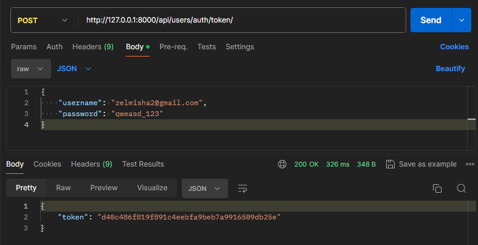
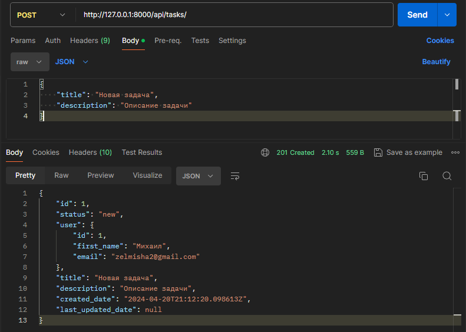
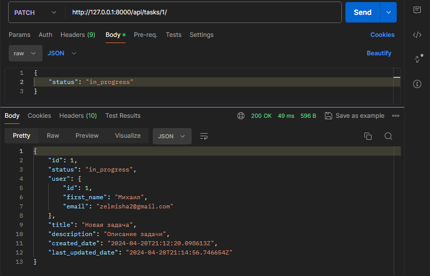
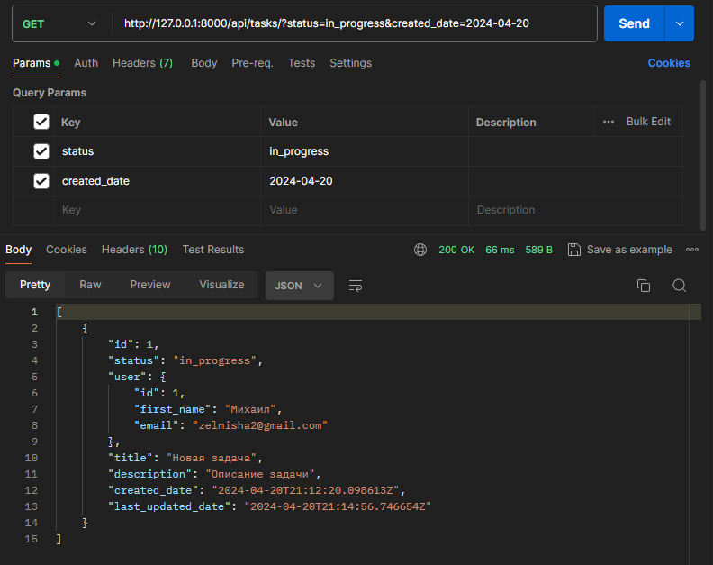
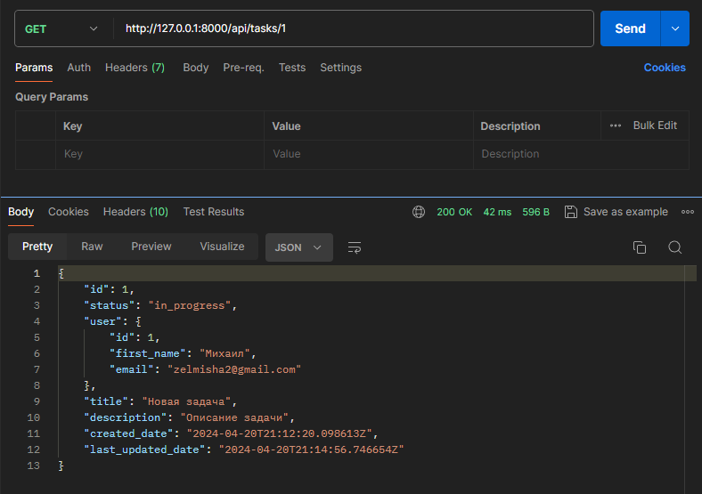
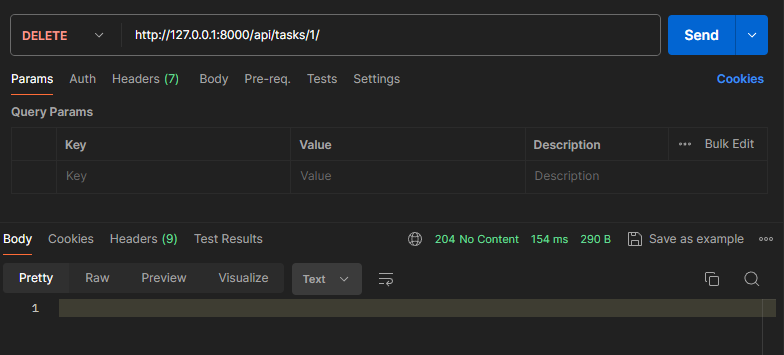

# TaskManagement
## Тестовое задание на позицию Python Developer 

## Техническое задание



## Используемый стек
- Python 3.12
- Django 5
- Django REST Framework
- PostgreSQL
- Redis
- Swagger

## Запуск приложения
1. Для локального запуска приложения понадобится Docker.<br> Инструкцию по установке можно найти на официальном сайте:
https://docs.docker.com/engine/install/
2. Склонируйте репозиторий:
    ```bash
    git clone git@github.com:qwertttyyy/SimpleMessenger.git
    cd TaskManagement
    ```
3. Создайте файл .env 
   ```dotenv
   # Django settings
   SECRET_KEY=secret_key
   DEBUG=True
   ALLOWED_HOSTS='localhost'
   
   # PostgreSQL settings
   POSTGRES_USER=admin
   POSTGRES_PASSWORD=password
   POSTGRES_DB=task_management
   DB_HOST=db
   DB_PORT=5432
   
   # Redis settings
   REDIS_HOST=redis://redis:6379/
   ```
4. Запустите контейнеры командой: `docker compose up -d`
5. Проект будет доступен по адресу http://localhost/
6. Для доступа к админке создайте суперпользователя командой: `docker compose exec api python manage.py createsuperuser`

## Основной функционал
#### 1. Регистрация пользователей. При регистрации обязательно передавать first_name и email.


#### 2. Аутентификация с username в виде email и паролем. В ответе получаем token. <br> Теперь можно передавать `Token <token>` в заголовке `Authorization`. 


#### 3. Создание задачи авторизованным пользователем.


#### 4. Изменение своей задачи. Изменить можно название задачи, статус и  


#### 5. Получение списка задач. Есть возможность фильтрации по статусу и дате создания через query-параметры.


#### 6. Получение конкретной задачи.


#### 7. Удаление своей задачи.



## Документация Swagger
   - #### На запущенном проекте доступна по адресу http://localhost:8000/api/swagger/
   - #### Также её можно посмотреть открыв файл [swagger_docs.html](swagger_docs.html) в браузере

## Тестирование
   - Написаны тесты для API.
   
      Тесты на регистрацию пользователя. Создание, обновление, получение и удаление задач. 
      
      Запустить тесты можно командой `docker compose exec api python manage.py test`